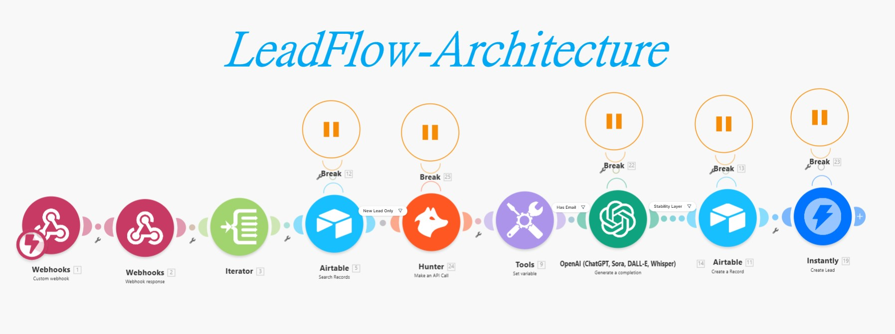

# LeadFlow Architecture 🚀


**LeadFlow Architecture** is a professional lead generation tool designed to automate the full pipeline — from data scraping to CRM integration via Webhooks and Make.com.

This project is intended for developers and marketing teams who want to streamline lead collection and outreach workflows.

---

## ✨ Features

- **Automated Scraping**  
  Extract leads from target websites using a built-in scraper.

- **Data Management**  
  Local SQLite storage for efficient processing and tracking.

- **Webhook Integration**  
  Send processed data to external services (Make.com, Zapier, etc.).

- **Outreach Pipeline**  
  Integrates with Airtable, OpenAI, Hunter, and Instantly.

- **Reliability & Error Handling**  
  Built-in error handling with “Break” directives.

- **Configurable Logging**  
  Flexible logging levels (DEBUG, INFO, ERROR).

---

## 🛠 Tech Stack

*   **Language**: [Python 3.x](https://www.python.org/)
*   **Database**: SQLite
*   **Testing**: [Pytest](https://docs.pytest.org/)
*   **Automation**: [Make.com](https://www.make.com/)
*   **Integrations**: Airtable, OpenAI, Hunter, Instantly

---

## 📦 Installation

### 1. Clone Repository

git clone https://github.com/PyDevDeep/LeadFlow-Architecture.git
cd LeadFlow-Architecture

### 2. Setup Environment

pip install -r requirements.txt
cp .env.example .env

### 3. Initialize Database

python main.py init

---

## 🚀 Usage

### 🔍 Scrape Data

python main.py scrape --url https://example.com

### 📤 Send Data

python main.py send

### 🧪 Run Tests

pytest

---

## ⚙️ Configuration

All configuration is managed via the `.env` file:

- DATABASE_PATH — Path to SQLite database  
- SCRAPER_TIMEOUT — Request timeout  
- WEBHOOK_URL — Webhook destination  
- WEBHOOK_BATCH_SIZE — Batch size for sending  
- LOG_LEVEL — Logging level  

---

## 🤖 Make.com Automation

A ready-to-use blueprint is available in the `/automation` directory.

### Setup Steps

1. Download `Make.json` or `outreach_pipeline.json`
2. Create a new scenario in Make.com
3. Select **Import Blueprint**
4. Configure integrations:
   - Airtable
   - OpenAI
   - Hunter
   - Instantly
5. Map fields:
   - YOUR_FIELD_ID_DOMAIN
   - YOUR_FIELD_ID_EMAIL
   - YOUR_FIELD_ID_COMPANY_NAME
   - YOUR_FIELD_ID_AI_RESPONSE

---

## 🖼 Pipeline Overview



---

## 📂 Project Structure

```text
.
├── app/
│   ├── scraper/          # Scraping modules (client, parser, logic)
│   ├── sender/           # Webhook sending logic
│   ├── utils/            # Utilities and logging
│   ├── config.py         # Environment configuration
│   └── database.py       # Database interaction layer
├── automation/           # Make.com blueprints and assets
│   ├── Make.json
│   └── Scenario_IMG.jpg
├── main.py               # CLI entry point
└── requirements.txt      # Project dependencies
---
```
## 🤝 Contributing

Contributions are welcome:

1. Fork the repository  
2. Create a feature branch  
3. Commit your changes  
4. Submit a Pull Request  

---
